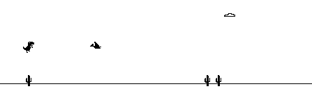

# Google Dino FPGA
VHDL implementation of the T-Rex game from Google Chrome

taken from 

# New Features 
- Added Duck Function
- Added Score Record & Display

### Chrome Version

### VHDL Version

# Contributors

